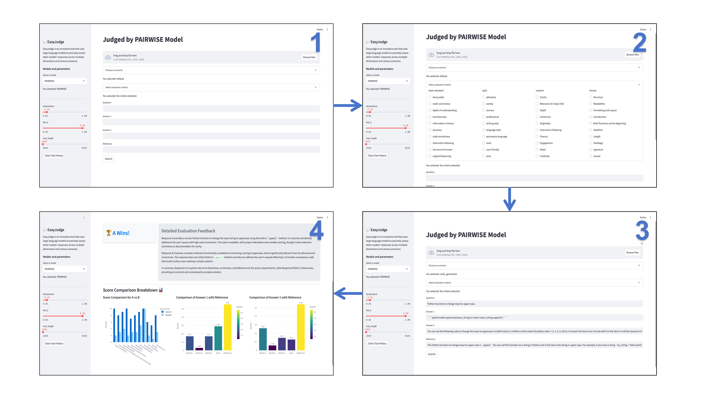

## EasyJudge: an Easy-to-use Tool for Comprehensive Response Evaluation of LLMs

- **Lightweight Usage Model**: EasyJudge is built to minimize dependency requirements, offering a simple installation process and precise documentation. Users can initiate the evaluation interface with only a few basic commands.

- **Comprehensive Evaluation Tool**: EasyJudge offers a highly customizable interface, allowing users to select evaluation scenarios and flexibly combine evaluation criteria based on their needs. The visualization interface has been carefully designed to provide users with an intuitive view of various aspects of the evaluation results.

- **Efficient Inference Engine**: EasyJudge employs model quantization, memory management optimization, and hardware acceleration support to enable efficient inference. As a result, EasyJudge can run seamlessly on consumer-grade GPUs and even CPUs.

### System Overview


### Model

EasyJudge is now available on huggingface-hub:
[🤗 4real/EasyJudge_gguf](https://huggingface.co/4real/EasyJudge_gguf)

### Quick Start

(Example of Deploying on autodl Cloud Server)

-#### Deploy ollama

##### 1. Start the installation software on autodl
```bash
export OLLAMA_HOST="0.0.0.0:6006"
export OLLAMA_MODELS=/root/autodl-tmp/models
curl -fsSL https://ollama.com/install.sh | sh
```

##### 2. Start the service
```bash
ollama serve
```

##### 3. Import EasyJudge models
Modify the path after `from` in each Modelfile to the local path where the model is downloaded from huggingface.
```bash
export OLLAMA_HOST="0.0.0.0:6006"
ollama create PAIRWISE -f /root/autodl-tmp/Modelfile/PAIRWISE.Modelfile
ollama create POINTWISE -f /root/autodl-tmp/Modelfile/POINTWISE.Modelfile
```

-#### Environment Configuration

(EasyJudge uses the environment PyTorch 2.3.0, Python 3.12 (ubuntu22.04), and Cuda 12.1.)

##### 1. Create conda environment
```bash
conda create -n EasyJudge
conda init
conda activate EasyJudge
```

##### 2. Install specified Python packages in bulk
```bash
pip install -r requirements.txt
```
### Acknowledge
